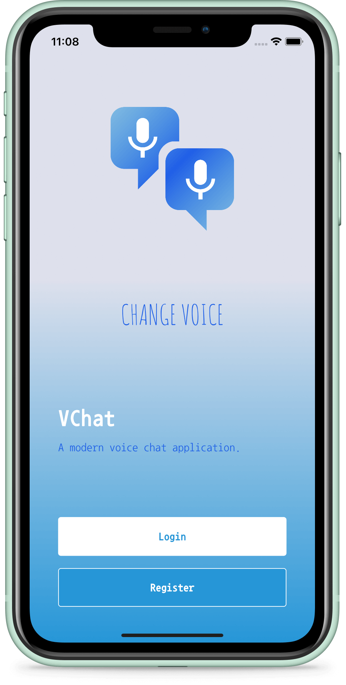
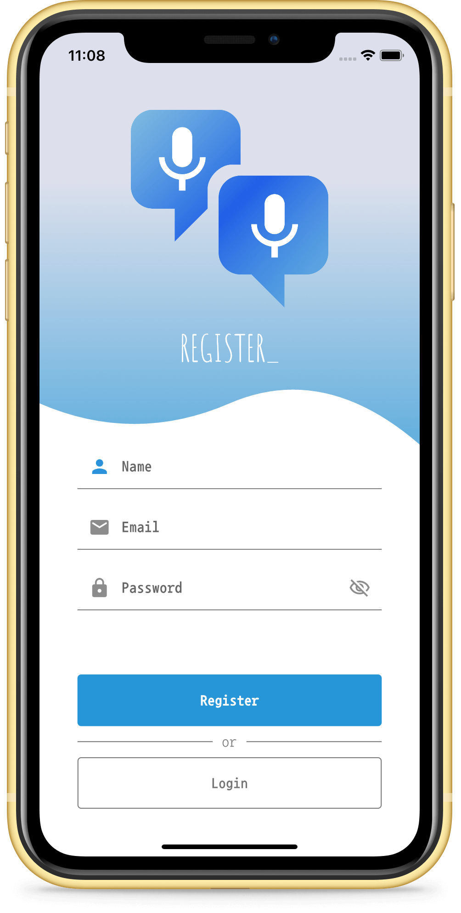
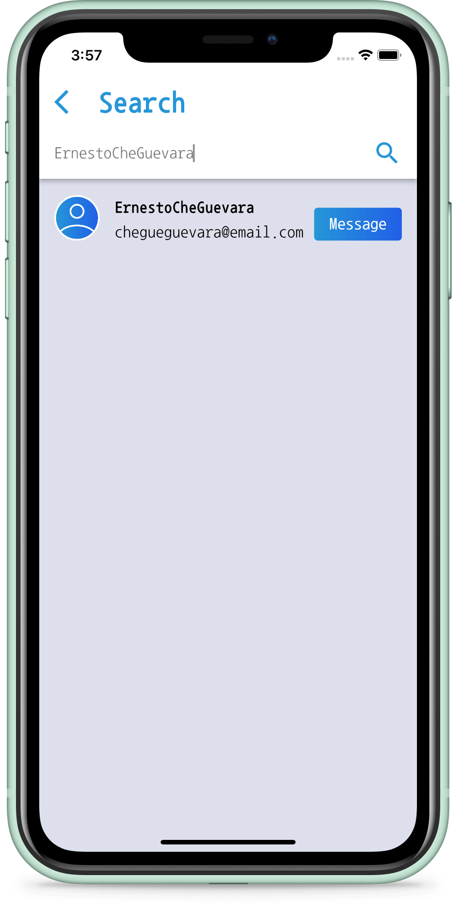
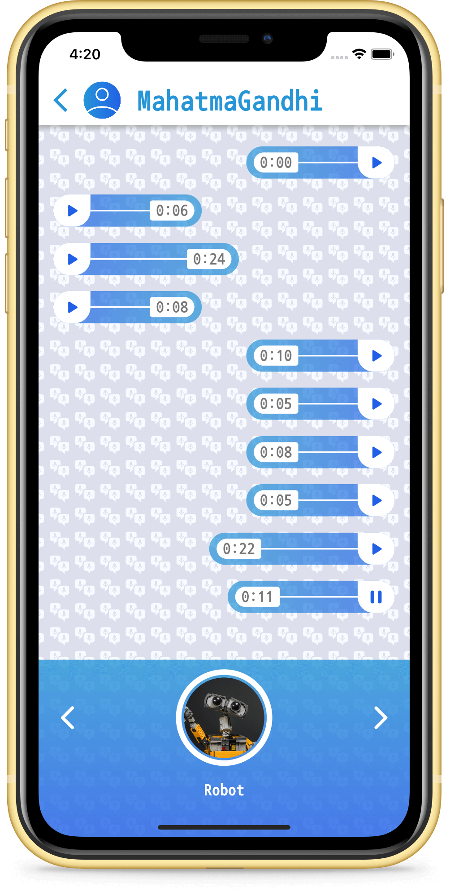

# 
VChat

A modern voice chat application. The application welcomes the user with the login screen. After a simple registration process, an empty "Home" screen shows up and lists previous chats. On the "Search" screen, it is possible to find other users and start a new chat with them.

Because of the purpose of the application, chat can be made between users only via voice. VChat provides eleven different sound effects to the users, so they can have fun while chatting with others.

With the power of [Flutter](https://flutter.dev/) and [Firebase](https://firebase.google.com/), VChat runs perfectly on both mobile operating systems. To be able to run this project after cloning this repository, you need to provide Firebase's [JSON](https://de.wikipedia.org/wiki/JavaScript_Object_Notation) files.

&nbsp;

## 1. Project Overview

The project written solely in [Dart Language](https://dart.dev/).

### 1.1. Welcome Page

A page that serves as the starting point of the application.

### 1.2. Login Page

A page where user identification and authentication is performed.

### 1.3. Register Page

A page that enables users to independently register and gain access to system.

### 1.4. Home Page

A page that shows the list of previous chats and provides access to other pages.

### 1.5. Search Page

A page where users can search the other users to start chatting with them.

### 1.6. Chat Page

The most important page of the app. Users can interact with others on this page and can send and receive voice records in real-time.

&nbsp; &nbsp;

&nbsp;

## 2. License

Licensed under the [MIT License](https://github.com/BBarisKilic/VChat/blob/master/LICENSE).